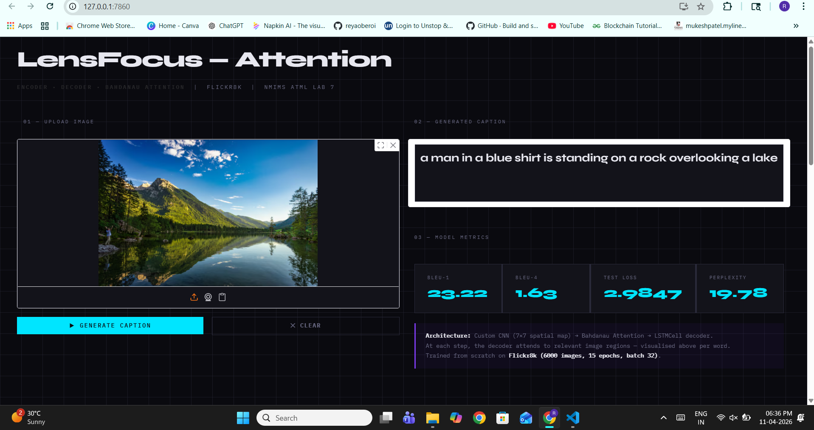
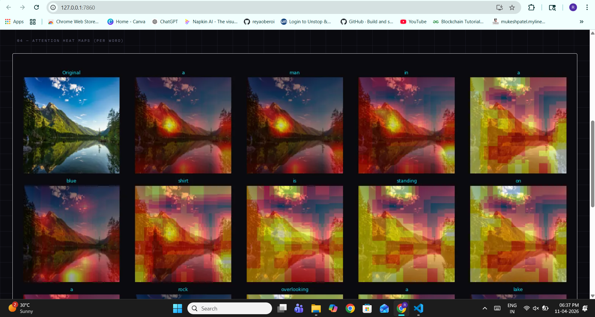

# 🔍 Image Captioning : Encoder-Decoder with Bahdanau Attention

Gradio web app for image captioning with live per-word attention heatmap visualisation.
Custom CNN + LSTMCell + Bahdanau Attention, trained from scratch on Flickr8k.

## Architecture
- **Encoder**: Custom CNN → spatial feature map (B, 49, 512) at 7×7 resolution
- **Attention**: Bahdanau (additive) — decoder queries each spatial location at every step
- **Decoder**: LSTMCell conditioned on attended context vector
- **Attention viz**: Matplotlib overlays rendered per word after caption is generated


## Interface Screenshots





## Setup & Run

### 1. Clone
```bash
git clone https://github.com/reyaoberoi/image-captioning-attention.git
cd image-captioning-attention
```

### 2. Create and activate virtual environment
```bash
python -m venv .venv
.venv\Scripts\Activate.ps1
```

### 3. Install dependencies
```bash
pip install -r requirements.txt
```

### 4. Run
```bash
python app.py
```
Opens at **http://localhost:7860**

## Dataset
[Flickr8k on Kaggle](https://www.kaggle.com/datasets/adityajn105/flickr8k)
